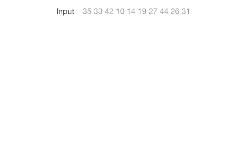

# Order Book

- Question: Which data structure will you use to implement a limit order book?
  And why?
- ChatGPT:
  To implement a limit order book, a combination of data structures is typically
  used to efficiently manage and access orders. The most commonly used
  structures are:

    1. Balanced Binary Search Tree (BST):
        - Implementation: Structures like Red-Black Trees or AVL Trees can be
          used.
        - Why: They allow for efficient insertion, deletion, and lookup
          operations, which are essential for managing orders. They can maintain
          sorted order, enabling quick access to the best bid and ask prices.
    1. Hash Map:
        - Implementation: A hash map can be used to store orders by their
          unique identifiers (like order IDs).
        - Why: It allows for O(1) average time complexity for lookups,
          making it easy to find and modify or cancel orders.
    1. Priority Queue (Heap):

        - Implementation: A max-heap for bids and a min-heap for asks can
          be used.

        - Why: This structure ensures that you can efficiently access
          the highest bid and the lowest ask at any time, which is crucial for
          matching orders.

    1. Doubly Linked List:
        - Implementation: Can be used to maintain the order of orders at a
          specific price level.

        - Why: It allows for efficient insertion and deletion of orders
          at the same price level, which is important for managing limit orders
          where multiple orders can exist at the same price.

- For the time being, let's focus on the limit order book only. A limit order is
  a type of order to buy or sell a security at a specific price or better.

- https://quant.stackexchange.com/questions/63140/red-black-trees-for-limit-order-book
- https://github.com/da-bao-jian/fast_limit_orderbook
- [RGM Advisors Order Book Programming Problem](https://github.com/perrye2/LimitOrderBook/tree/master)

## Binary search tree

- A Binary Search Tree (BST) is a type of Binary Tree data structure, where the
  following properties must be true for any node "X" in the
  tree [[1](https://www.w3schools.com/dsa/dsa_data_binarysearchtrees.php)]:

    - The X node's left child and all of its descendants (children, children's
      children, and so on) have lower values than X's value.
    - The right child, and all its descendants have higher values than X's
      value.
    - Left and right subtrees must also be Binary Search
      Trees.

      

### Common operations

- Insert

  
- Search (omitted for being too simple)

- Delete
    - If the node to be deleted is a leaf (i.e., it has no children): omitted
    - If the node to be deleted has one child: omitted
    - If the node to be deleted has two children:

      

## Heap

- A Min-Heap is a Data Structure with the following
  properties.[[2](https://www.geeksforgeeks.org/introduction-to-min-heap-data-structure/)]
    - It is a complete Complete Binary Tree.
    - The value of the root node must be the smallest among all its descendant
      nodes and the same thing must be done for its left and right sub-tree
      also.

### Common operations

- Insert

  

- Delete

  